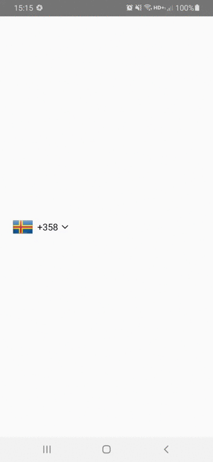

# React Native Calling Code Picker
 
---

A searchable dropdown component to select a country code for your phone number input.



## For Managed Workflow users using Expo
This component is not supported in the managed workflow for expo for the time being.

## Getting started

```npm install react-native-calling-code-picker --save```

or

```yarn add react-native-calling-code-picker```

Also you need to manually install ```react-native-svg``` library for the icons in the component

```npm install react-native-svg --save```

or

```yarn add react-native-svg```

### For react-native@0.60.0 or above

As [react-native@0.60.0](https://reactnative.dev/blog/2019/07/03/version-60) or above supports autolinking, so there is no need to run linking process. 
Read more about autolinking [here](https://github.com/react-native-picker/cli/blob/master/docs/autolinking.md).

#### iOS
CocoaPods on iOS needs this extra step

```
npx pod-install
```

#### Android
No additional step is required.

## Usage

First of all, import the component.

```javascript
import { CallingCodePicker } from 'react-native-calling-code-picker';
```

Then use it like this.

```javascript
const [selectedCallingCode, setSelectedCallingCode] = useState('');

  return (
      <CallingCodePicker
        selectedValue={selectedCallingCode}
        onValueChange={value => setSelectedCallingCode(value)}
      />
  );
```

## Props
- [`selectedValue`](#selectedValue)
- [`onValueChange`](#onValueChange)
- [`containerStyle`](#containerStyle)
- [`pickerTogglerLabelStyle`](#pickerTogglerLabelStyle)
- [`listContainerStyle`](#listContainerStyle)
- [`searchInputStyle`](#searchInputStyle)
- [`listStyle`](#listStyle)
- [`pickerItemLabelStyle`](#pickerItemLabelStyle)

---

# Reference

## Props

### `selectedValue`

Value matching value of one of the items. Can be a string.

| Type     | Required |
| -------- | -------- |
| string | No       |

---

### `onValueChange`

Callback for when an item is selected. This is called with the following parameters:

* `itemValue`: the value of the item that was selected

| Type     | Required |
| -------- | -------- |
| function | No       |

---

### `containerStyle`

Style to apply to the main container. (for ex. you can give absolute positioning to align it inside the input.)

| Type     | Required |
| -------- | -------- |
| StyleProp | No       |

---

### `pickerTogglerLabelStyle`

SStyle to apply to the picker toggler label.

| Type     | Required |
| -------- | -------- |
| StyleProp | No       |

---

### `listContainerStyle`

Style to apply to the list container.

| Type     | Required |
| -------- | -------- |
| StyleProp | No       |

---

### `searchInputStyle`

Style to apply to the search input.

| Type     | Required |
| -------- | -------- |
| StyleProp | No       |

---

### `listStyle`

Style to apply to the FlatList component.

| Type     | Required |
| -------- | -------- |
| StyleProp | No       |

---

### `pickerItemLabelStyle`

Style to apply to each of the item labels.

| Type     | Required |
| -------- | -------- |
| StyleProp | No       |

---
